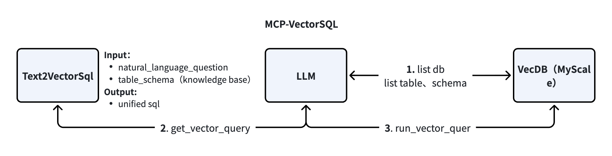

# MCP-VectorSQL

## Overview

MCP-VectorSQL is a powerful vector SQL generation tool that converts natural language questions into high-quality SQL queries, specifically designed for vector databases. It enables users to interact with vector databases using natural language, simplifying complex vector search operations.

## Architecture



The architecture consists of three main components:

1. **Text2VectorSql**: Handles natural language input and generates unified SQL output
2. **LLM**: Processes natural language questions and generates vector queries
3. **VecDB (MyScale)**: Performs vector similarity searches and stores vector data

The workflow includes:
- Step 1: LLM lists database tables and schemas from the vector database
- Step 2: Text2VectorSql gets vector queries based on natural language questions
- Step 3: VecDB executes vector queries and returns results

## Core Features

### Natural Language Processing
- Accepts direct natural language questions from users
- Converts natural language into structured vector queries
- Supports complex questions with multiple conditions

### Vector Similarity Search
- Performs efficient similarity searches on vector databases
- Supports various similarity metrics (cosine similarity, Euclidean distance, etc.)
- Optimized for large-scale vector datasets

### Answer Integration
- Processes and integrates results from vector searches
- Combines information from multiple sources if needed
- Generates coherent and comprehensive answers

### Response Generation
- Returns natural language answers based on search results
- Provides relevant and accurate information to users
- Maintains context and relevance throughout the conversation

## Quick Start

### 1. Configure Environment

```bash
# Copy environment variable example file
cp .env.example .env
```

Modify the `.env` file with your configuration:
- API settings (API_KEY, API_URL, etc.)
- Database settings (MYSCALE_HOST, MYSCALE_PORT, MYSCALE_USER, etc.)
- Server settings (MCP_SERVER_TRANSPORT, MCP_BIND_HOST, etc.)

### 2. Initialize and Run MCP Server

```bash
# Initialize runtime environment
uv sync --all-extras --dev

# Run MCP server
uv run python -m mcp_server.main
```

### 3. Register MCP Tools in Dify

Register the MCP server with the Dify platform to use its SQL generation capabilities.

## License

Please refer to the [LICENSE](LICENSE) file for license information.

## Contact

For questions or suggestions, please contact the development team.
